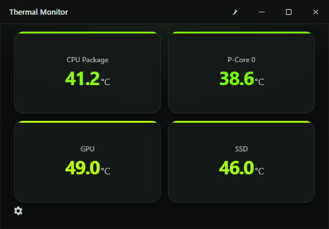
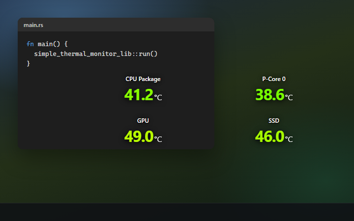

# Simple Thermal Monitor 3.0

Lightweight Windows overlay for CPU, GPU, and SSD temperatures.

<p align="center">
  
  <br />
  <em>Windowed</em>
</p>

<p align="center">
  
  <br />
  <em>Transparent mode</em>
</p>

Always-on-top cards for **CPU Package**, **P-Core 0**, **GPU**, and **SSD**, with a settings drawer for refresh delay, transparency, and text size.

## Download

Get the latest Windows x64 build from [Releases](https://github.com/I-am-Yes/simple-thermal-monitor-v3.0/releases/latest):

- **Installer (recommended):** `Simple Thermal Monitor_3.0.0_x64-setup.exe` — per-machine setup; accepts the UAC prompt so CPU sensors can use LibreHardwareMonitor
- **Portable:** unzip and keep `Simple Thermal Monitor.exe` next to `stm-lhm.exe`

## Sensors

| Source | What it reads |
| --- | --- |
| LibreHardwareMonitor **0.9.6** + **PawnIO** | CPU package, P-core 0, NVIDIA GPU |
| NVML / WMI / storage IOCTL | Fallbacks when LHM has no value |

This app does **not** load WinRing0. CPU package and per-core temps from LHM need administrator plus [PawnIO](https://github.com/namazso/PawnIO). If PawnIO is missing, an elevated first launch can install it. GPU and SSD still work from user-mode APIs.

## Develop

Needs Node.js, Rust, and the .NET 8 SDK (for the `stm-lhm` sidecar).

```bash
npm install
npm run tauri dev
```

`tauri dev` skips the UAC prompt, so CPU package / P-core 0 may stay on the ACPI fallback until you run a release build as admin.

```bash
npm run tauri build
```

## License

MIT
